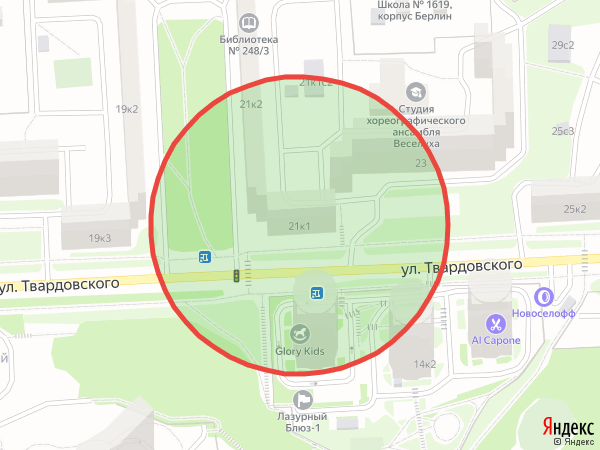

# quarantine_bot
Бот для отрисовки на карте примерной зоны доступности от адреса

__Запуск бота:__
1. Создаем бота и получаем API ключ у пользователя Botfather в телеграмм;
2. Получаем в [Yandex.Maps](https://tech.yandex.ru/maps%20/ "Yandex.Maps") API ключ разработчика;
3. Прописываем в ключи в TELEGRAM_BOT_KEY и MAPS_API_KEY (например `export TELEGRAM_BOT_KEY="qwerty123"`);
4. Запускаем python main.py;
5. Стартуем общение с ботом командой /start;
6. Запрашиваем зону командой /zone Адрес.

__Примечания:__
- Бот работает на геокодере и картах Яндекса. Соответственно, есть ограничение по количеству запросов в день на 1 ключ. Но оно достаточно большое (десятки тысяч запросов в день);
- Зона отрисовывается от точки геокодирования здания. То есть, если дом очень протяженный, то нужно учитывать расстояние от каждой точки, то есть делать буфер вокруг полигона дома. Но для этого нужны все полигоны домов.

Пути развития:
1. Улучшение отображения зоны;
2. Поиск ближайшего магазина/аптеки и построение маршрута до них;
3. Улучшение выдерживаемой нагрузки (очереди, асинхронная обработка);
4. Ограничения на количество запросов/ частоту запросов;
5. Испльзование нескольких ключей для увеличения квоты.

__Пример вывода:__

